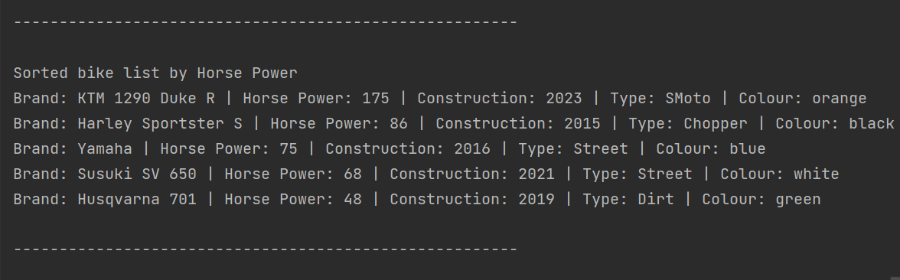

**Konfigurationmanagement**
# Motorraedern Sortierung
## Description

From the title you can immediatly
know that the project is 
about sorting motorcycle.

>No matter how many brands of motorcycle you 
> enter or whatever you want from the characteristics
> i mentioned bellow .. it will be correctly 
> sorted accordingly.

The various lists are visually 
separated.. that means that each 
output is separeted by  a line to
make it easier to notice.

### What should this project achieve?
The idea of this project is to sort
motorcycle by:
- brand
- speed
- colour
- constructionYear
- type

Every time the programm will be 
printed there will be the  
characteristic that has beeen sorted
(It will be written at the top of the 
sorted list)
in addition to all other characteristics
but unsorted.

Check the example

### Example
This Example shows how the output should 
look like.

For mor information about [sorting](https://www.geeksforgeeks.org/sorting-in-java/) in Java chack the link

## Installation
If you have Java already on your desktop then 
you just have to unzip the project and 
then setup the main class in your device
and then start to run the programm.
The programm delivers the output through 
the console.

If you do not hava Java on your desktop then
you have to install an IDE for example
IntelliJ and then Install a JDK. Now you have 
Java on you desktop so you can follow the
instruction that I mentioned above.

[How to install IDE](https://www.geeksforgeeks.org/step-by-step-guide-to-install-intellij-idea/)

[How to download a JDK](https://www.jetbrains.com/idea/guide/tips/download-jdk/)

## Usage
After the unzip of the file  just open it and from
the file choose the folder named '**src**'.

If you open it you will get those classes

To run the programm open the '**Application**'
class and as i mentioned before you just have to click on
the run button and you will immediately get 
the output through the console.

### Why i build this project?
This project was a task. I had
to create many classes and that was 
the main point of the task. The classes
had to be connected to each other.

## Support
If you need support or have any question 
you can reach me through 
>email
> 
>[*alaa.abouelfadl@edu.fh-joanneum.at*](https://elearning.fh-joanneum.at/user/profile.php)

>twitter
>
>[*Alaa Abou El Fadl*](https://twitter.com/Alaa__Khairy)

## About me
This project was the second code i ever wrote
by myself. The first semester was the forst time 
for me dealing with devices etc. but in addition to 
that I  had another programming language
in the first semester. I studied Software Design &
Cloud Computing. So I had python as a first 
programming language. I am still not good at coding.
But I am trying to give my best.

# Information about the Author
>## Study
>I am a Mobile Software Development student at FH JOANNEUM
(University of Applied Sciences), which was unexpected, as I
found my passion after trying a lot of fields, my first
trial was in Egypt as I started to study Linguistics.
After two years I realized that it was boring for me,
so I went for something related to computers.
>## Hobbys
> - Drawing 
> - - my [tictok acount](https://www.tiktok.com/@alaa.kh01) for my Paintings 
> - Dancing
> - Watching Anime
> - Reading Manga
> - Walking

>## Github 
>My GitHub Profil:
>- [https://github.com/AlaaAbouElFadl](https://github.com/AlaaAbouElFadl)
>
>GitHub HomePage:
>- [https://github.com/](https://github.com/)
>
>## High School
>I graduated from my High school in Egypt 
>
>[My High School](https://www.bing.com/search?q=+%D9%85%D8%AF%D8%B1%D8%B3%D9%87+%D8%A7%D9%84%D8%B3%D8%A7%D8%AF%D8%A7%D8%AA+%D8%A7%D9%84%D8%AB%D8%A7%D9%86%D9%88%D9%8A%D9%87++%D8%A8%D9%86%D8%A7%D8%AA+%D8%A7%D9%84%D8%AB%D8%A7%D9%86%D9%8A%D9%87&qs=n&form=QBRE&sp=-1&lq=0&pq=+%D9%85%D8%AF%D8%B1%D8%B3%D9%87+%D8%A7%D9%84%D8%B3%D8%A7%D8%AF%D8%A7%D8%AA+%D8%A7%D9%84%D8%AB%D8%A7%D9%86%D9%88%D9%8A%D9%87++%D8%A8%D9%86%D8%A7%D8%AA+%D8%A7%D9%84%D8%AB%D8%A7%D9%86%D9%8A%D9%87&sc=1-37&sk=&cvid=F006453C2FA4443298311237AE16A911&ghsh=0&ghacc=0&ghpl=)
>
>High School Facebook Account: 
>- [https://www.facebook.com/ElsadatSchool.1/](https://www.facebook.com/ElsadatSchool.1/)
## Additional important coniguration files
If you run you test the entires are going to be saved in this file
- [myapp.log **file**](logs/myapp.log)

You can find the configuration code in this file
- [log4j2.xml **file**](src/main/resources/log4j2.xml)

This configuration should help the beginners to configure (This is important to know how to configure)
- [log4j2.xml.template **file**](src/main/resources/log4j2.xml.template)

## Exercise Files
- [Exercise1](exercise1.md)
- [Exercise2](exercise2.md)
- [Exercise3](exercise3.md)
- [Exercise4](exercise4.md)
- [Exercise5](exercise5.md)