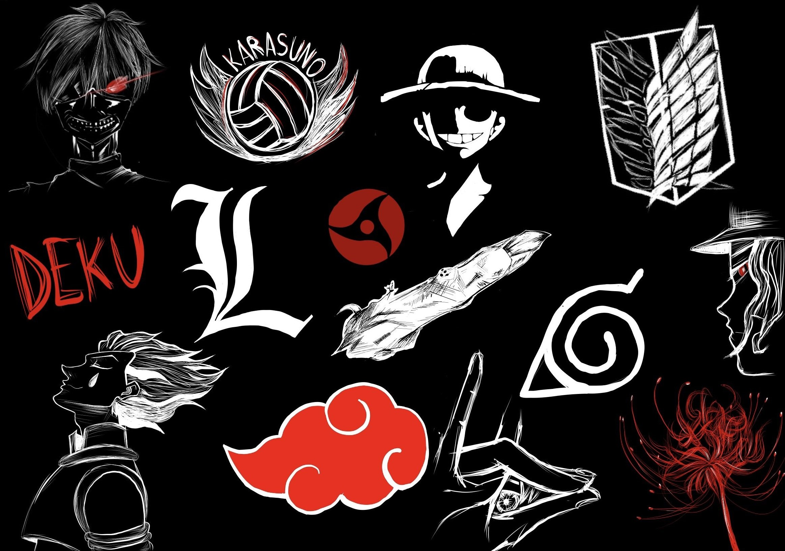

# My Painting
Lately I draw an image for my web
project

This drawing includes several 
different logos of animes and 
anime characters.

I used this image as a home image as 
I thought it will show that website will
be about animes.

It was a Gallery for otaku and there was a site
for my paintings and another site that contains
quotes said my anime character. Creating this
website was amusing as I decided to choose a content 
 that I really like.

If you do not know what okaku means,
check this link named (more about otaku) below.

[more about otaku](https://de.wikipedia.org/wiki/Otaku)

## Why I like Anime
>The reason why I like anime is that it
really conveys beautiful and soft feelings
and it is really the thing that get me out
of my disappointment.

### How I painted it
>I became the idea of the painting and 
finished it within three days..but I have
to say that it was not that easy..
but as long as it is a painting than I have
to confess that it was amusing.

### Animes that are in the painting
>**Tokyo Ghoul** - **Naruto** - 
> **Attack on Titan** - **Hunter x Hunter** -
> **One Piece** - **Jujutsu Kaisen** -
> **Boku no Hiro** - **Kimetsu no Yaba** -
> **Death Note** - **Haikyu** - 
> **Chainsaw Man**
>
> -- Of course i could not mention all
> animes but i think those are the most
> common ones.

