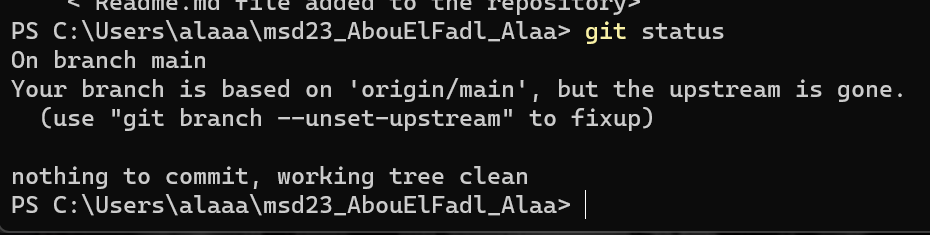
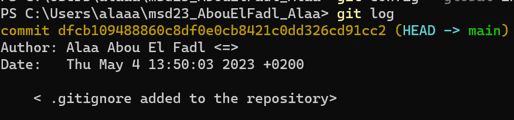

## git config
- It is used to set Git
configuration values on a local machine  or global
Git server. It also allows us to tell Git who 
we are and what our e-mail address is.
- Parameters:
- 1. **'--global' >>** is to set the configuration 
globally for all Git repositories.

example:
```
git confif --global user.email "<e-mail address>"
```
  2. **'--local' >>** is to so set the configuration
locally for the current Git repository.
  3. **'--get' >>**  is to show the value of the
configuration option.
  4. **'--list'**  is to show all 
configuration option.
  5. **'--unset'**  is to remove the 
configuration option.
- The data that was configured with **'git 
config'**  firstly affects the **Metadata**
of the Git system such as the user name, the 
e-mail address, changing default directory
structure of Git repositories, etc and those 
settings doesn't have an affection on the actual
data or files in your repository.
- The changes are typically local and it affects
the Git repository and the working directory 
where the command was executed we also can use 
**'--global '** to make it global that means 
that all changes will be applied to all Git 
repositories on your machine. The changes that 
was made on the Git server only affect that 
repository and does not Git config. of other user.


## git init
- It initializes a new Git 
repository in a new directory or on your 
local machine and if you run it, it will
create in your current working directory
a new subdirectory that is named **git** 
and that contains all necessary files for Git
version control.
- It doesn't have Parameters.
- The '.git' subdirectory that will be initialized
through the 'git init' command in the project
directory contains all necessary files for 
Git version control such as the object database,
the configuration file and the index file and to 
store all commits, branches, tags and other 
version control related data we will use those
files.
- The changes are local and only and 
only affects the directory where the 
command was executed. The changes includes
all the points i mentioned in the third point 
and you can add files and directories with
'git add' once the repository has been initialized
and you can also commit changes using 'git commit'.


## git commit
- It creates a new commit 
with the changes you  have added with the
'git add' command.
- Parameters:
- 1.  **'-m' >>** is to specify the commit 
message inline.

example:
```
git commmit -m "<the comment>"
```
  2. **'--allow-empty' >>** is to allow
committing an empty change.
  3. **'--amend' >>** is to modify the previous
  commit.
- The 'git commit' command stores the changes 
I have staged in thr repository's object database
and also with 'Metadata' such as the author, commit
message and timestamp.
- The 'git commit' changes the state of the 
commit by creating a new commit. This change 
is local until it will be pushed to the 
server. The changes are typically made in the
staging area. This is where the changes 
have been added with the 'git add' and once 
you commit them they will be moved from the 
staging area to the repository's object database.

  
## git status
- It shows the status of my working directory,
which files have been modified, which files are untracked## git add
and which files are staged for commit.

example:

-  It doesn't have Parameters.
- Doesn't modify any data it only displays 
the current state of the working directory.
- Doesn't make any changes. But it could 
help determine which files you need to save 
or change.

## git add
- It stages changes for a commit.
It tells Git to include the changes in the
next commit.
- Parameters:
- 1. **'-p' >>** is to select changes to stage
interactively.
  2. **'-u' >>** is to stage modified and
deleted files.
- It modifies the content of the Git index,
that is a staging area for changes that will
be included in the next commit. But it doesn't 
modify contents of the working directory 
or the repository itself.
- The working directory or the repository
doesn't get changed. but the 'git add' command
can modify the contents of the Git index,
and the changes that have been staged will
be added for the next commit. The command 
modifies the content of the Git index that
is a local data structure that stores the changes 
to be committed. The changes are made locally
on the computer and must be pushed to a remote
repository to be shared with others.


# git log
- It shows the commit history of a repository.
It also shows a list of all commits with the 
commit message, author, timestamp, etc.

example:

- Parameters:
- 1. **'--pretty' >>** is to specify the 
format of the output.
  2. **'--grep' >>** is to search for commits
that match a specific pattern.
  3. **'--since  and --until >>** to filter the
outpt by date range.
- Doesn't modify any data it only displays
the commit history of the Metadata.
-  Doesn't make any changes to the repository.
But it shows the commit history so it can 
be used to understand the repository's history.


## git diff
- It shows the differences between two versions
of a file, or between two working directory
and the staging area.
- Parameters:
- 1.  **'--cached' >>** is to show the difference
between staging area and the last commit.
  2. **'--color' >>**  is to highlight thr
differences with color.
  3. **'--word-diff' >>** is to show only the 
changed words instead of ful lines.
- Doesn't modify any data it only displays
the difference between working directory
and staging area.
- Doesn't make any changes to the repository.
  But it helps to understand thr changes 
you have made to any file.
## git pull
- It fetches and merges changes from a remote
repository into the current branch of the
local repository.
- Parameters:
- 1.  **'--rebase' >>** is to rebase the
current branch into the fetch branch.
  2. **'--no-commit' >>**  is to fetch and merge
the changes, but that's not automatically,
a new commit must be created.
- Doesn't modify any data it only displays
 it only fetches changes and merges them 
into the local repository.
- It may modify local repository by creating new 
commmits to reflect the merged changes.


## git push
- It sends changes in the local repository
to a remote repository.
- Parameters:
- 1.  **'--force' >>** is to push changes 
even if they conflict with changes in the 
remote repository.
  2. **'--dry-run' >>** is to preview the 
changes that will be pushed without actually 
pushing them.
- Doesn't modify any data in thr the local 
repositry it only sends changes to the 
remote repository.
- The remote repository may be modified 
by creating new commits to reflect the 
pushed changes. It only changes the data 
on the server by uploading the changes from
 the working directory to a new version of the 
server, in that case  the local data in 
the working directory or staging area 
are not changged. 