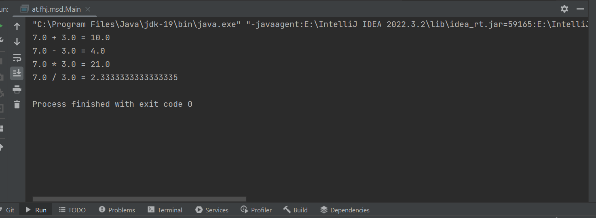
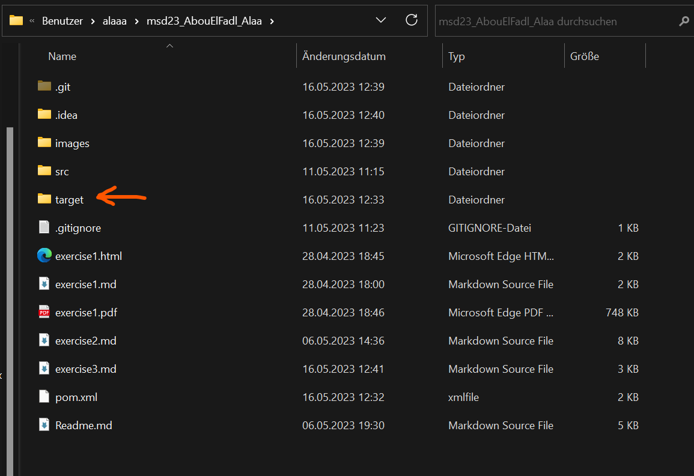
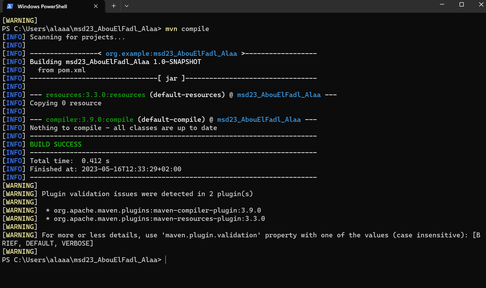

# Calculator

## Description
This program is a calculator.
I made this program with two classes. 

The first one is the "Calculator.java" and 
the second one is the "Main.java".
The program delivers the output through the console.

## What should the project achieve?
As I mentioned before, the program includes 
two classes. 
The program calculates with the four
operators ('+', '-', 'x', '/'),
writes in the output the values you 
gave to "num1" and "num2"
and delivers the result.
**Look at the example bellow!**

The first one is the "Calculator.java" 
and this class includes the methode of
the four possibilities:
- **add**
- **subtract**
- **multiply**
- **divide**

The second one is the "Main.java"
and that is where I declared the first 
value "num1" and the second value "num2".
I also wrote in this class what exactly 
should be printed with the end results. 

I gave the results of every case ,

- for the  addition **"addResult"** 
- for the  subtraction **"subtractResult"**
- for the  multiplication **"multiplyResult"**
- for the  divideResult **"addResult"**

### Example
This is how the output looks like.
It depends only on the values you give
to "**num1**" and "**num2**"

## Installation
If you have Java installed on your Desktop
then it will be very easy for you.

Otherwise you can install IDE and JDK.
This Link will Help you.

[How to install IDE](https://www.geeksforgeeks.org/step-by-step-guide-to-install-intellij-idea/)

[How to download a JDK](https://www.jetbrains.com/idea/guide/tips/download-jdk/)

## Usage 
If you successfully installed the IDE and JDK.
You just have to unzip the file and open the 
two classes, setup the jdk and run the Main class.
The output will be delivered through the console.
You van change the values if you want in the
"Main.java" class.

## The program
While running the program for the first time
I noticed that a folder named "target" was
created.

Here is a screenshot of the folder

this is a screenshot of my successful mvn compile 
build

## Why I build this project?
This project was an assigment. It was about
building a simple calculator.

## Support
If you need support or have any question
you can reach me through
>email
>
>[*alaa.abouelfadl@edu.fh-joanneum.at*](https://elearning.fh-joanneum.at/user/profile.php)

>twitter
>
>[*Alaa Abou El Fadl*](https://twitter.com/Alaa__Khairy)