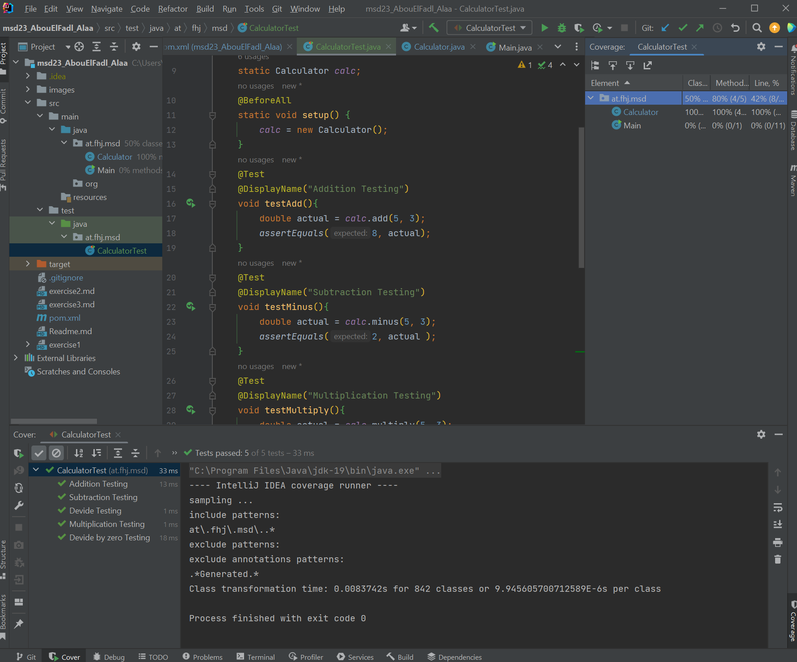

# Calculator Test
## Description
This program is called "CalculatorTest"
and is connected with the two classes 
"Main.java" and "Calculator.java".

## What should the project achieve?
The Calculator Test is to test if the 
expected output is like the actual output.
If this is true the Program will run with a
successful confirmation otherwise 
it will give you an error.
  
Whe the expected is like the actual that
means that the Test methods worked successfully and 
in our Task we had to make a screenshot of this
I will leave it right here 

I also made a screenshot of the whole successful
Tests.. this is a screenshot of them

## The Test methods
I made in the **"CalculatorTest"** the
methods for the program And they are 8
methods
>- The first one is the **"Addition Testing"**
   for the addition of two values And it compares
   the actual with the expected if they are
   equal then the result is correct.

>- The second one is the **"Subtraction Testing"**
   for the subtraction of two values And it
   works exactly like the addition.

>- The third one is the **"Multiplication Testing"**
   for the multiplication of two values.

>- The fourth one is the **"Divide Testing"**
   for the division of two values.

>- The fifth one is the **"Divide by zero Testing"**
   for the division by zero And this should throw
   an exception.

>- The sixth one is the **"FactorialForZero test"**
   for the Factorial of zero that should actually return
   "1" .

>- The seventh one is the **"FactorialForPositivNum test"**
   for the Factorial of a positive number it should deliver
   the real result.

>- The eighth one is the **"FactorialForNegativNum test"**
   for the Factorial of a negative number and this should
   deliver zero.

**For the last three methods I left examples of the outputs bellow.**

## Factorial three test methods
In our Task we had to make a Faculty case 
And  we hat to make it return zero ,
one of the three got it right but the two
others did not work as showed in the screenshot
bellow.

The screenshot of the output were also in our
Task So I will leave it bellow,

We had also to mke the three Test methods work,
so I made the right methods And it worked at 
the end So I will leave a screenshot of the
working three methods below

## Usage
When you open the file you will hava to setup the 
jdk And then you are going to make a right click on 
the CalculatorTest and then choose "More Run/Debug "
and then choose "run CalculatorTest with coverage"

## Why I build this project?
This project was an assigment. It was about
building a test for the Calculator that we had created.

## Support
If you need support or have any question
you can reach me through
>email
>
>[*alaa.abouelfadl@edu.fh-joanneum.at*](https://elearning.fh-joanneum.at/user/profile.php)

>twitter
>
>[*Alaa Abou El Fadl*](https://twitter.com/Alaa__Khairy)