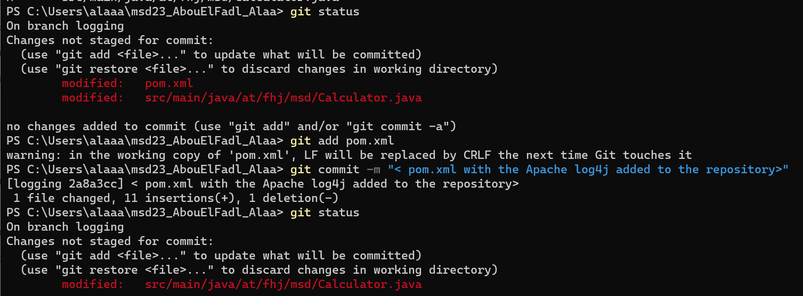
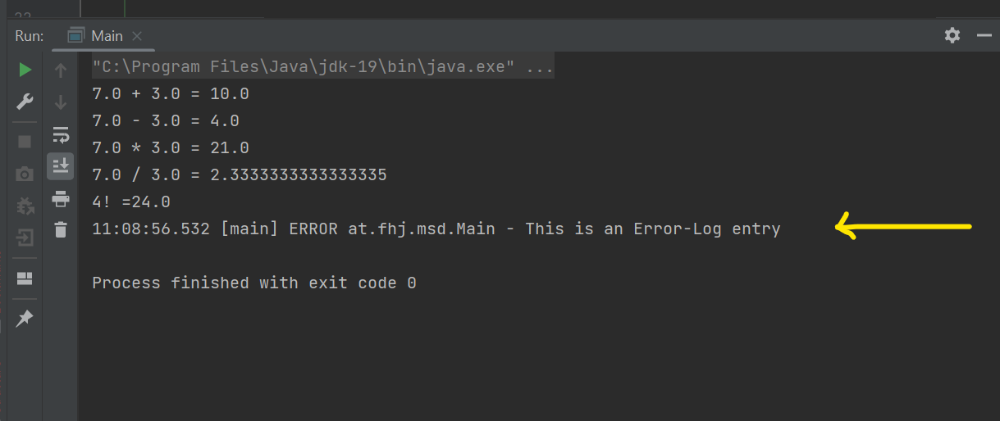
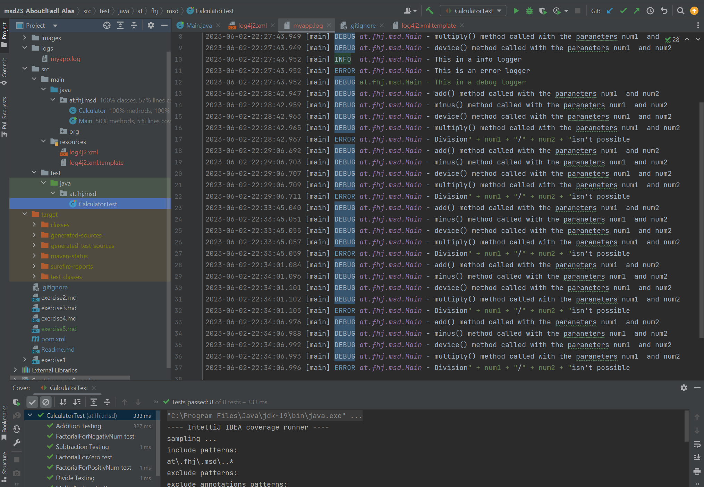
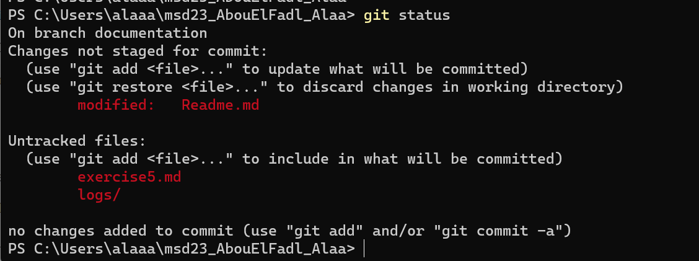

# Logging Libraries

### Why are Logging Libraries  used?

They are used to enable the logging of information,
error, warning etc. in ana application. They provide
a structured way to capture and store relevant information
for later analysis, monitoring or troubleshooting purposes.

Here are some reasons why they are used in software 
projects:
1. **Debugging and Troubleshooting:**
Logging allows developers to capture information  
about program flow ,variable states and the execution
of statements.
This helps in tracing program flow, diagnosing issues 
and identifying errors for troubleshooting purposes.

2. **Documentation and Analysis:** Logging helps in 
documenting the development process and activities 
in an application. The logged information can be used
for future analysis, reporting or communication with 
other team members.

3. **Monitoring and Performance Analysis:** By
logging metrics and performance indication, 
developers and system administrators can monitor the 
performance of an application. This enables the 
detection of bottlenecks, identification of performance
issues an optimization of the application.

### What log levels are there in Log4J and what is it all about?
there are several log levels that represent different  
levels of severity or importance for logged messages.
These log levels help in categorizing and filtering 
log entries based on their significance. 
 
Here are the log levels:
1. **TRACE** provides detailed debugging information 
for most detailed logs.
2. **DEBUG** is used for less detailed debugging And it
provides information about the flow and state.
3. **INFO** is used for general information  
and status updates. It confirms the successful execution
af important processes or provides general status updates.
4. **WARN** it shows a potential issues or warnings that
require attention. It alerts developers about situations
that might lead to errors.
5. **ERROR** represents errors that occurred during 
the execution of the application.
6. **FATAL** describe critical errors that cause the
application to terminate.

### What configuration options does log4J offer you?
The configuration options:
1. **Configuration File:** You can use a configuration file 
(XML, JSON, or Properties format) to define logging 
settings.
2. **Log Levels:** You can set log levels for each logger 
component to control which messages are logged.
3. **Appenders:** You can configure different appenders to
direct log output to various destinations (file, console, etc.).
4. **Layouts:** You can define the format of logged 
messages using patterns (date, log level, message, etc.).
5. **Hierarchical Logging:** You can create a hierarchy of loggers
to control message propagation between parent and child loggers.
6. **Filters:** You can apply filters to selectively log messages 
based on specific criteria.

And these options allow for flexible and customized logging.

## Important Screenshots

1. This screenshot shows that 
 - I am in the logging branch 
 - The pom.xml has changed

2. I noticed that the Error logger 
was printed at the end of the output.
It was just the error logger although 
i added other loggers!

3. This screenshot shows my test 
tht I ran multiple times with
multiple entries in the log file.
I also provided the date and the time.

4. This screenshot shows that
- I am in the documentation branch
- The exercise5.md has been created 

