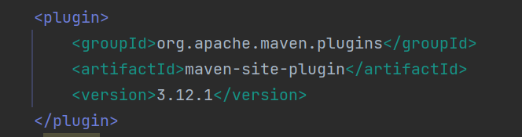
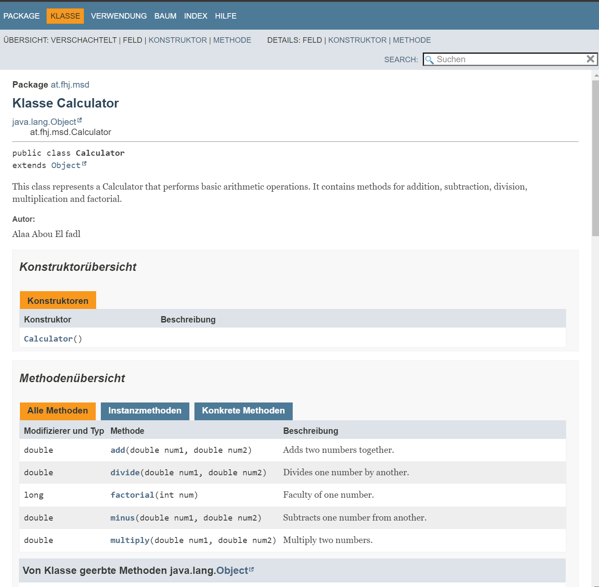
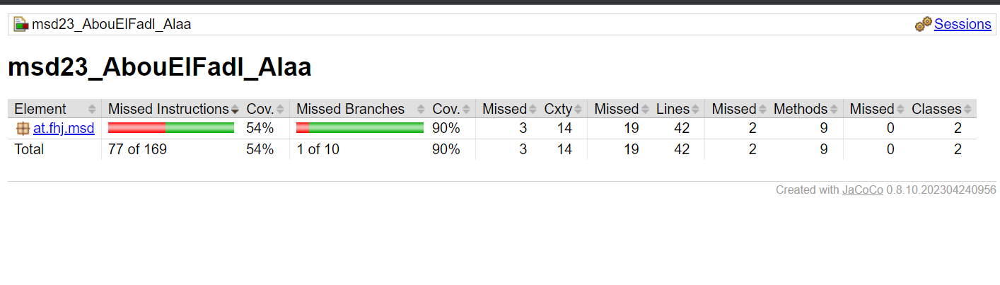

# Documentation

## What is necessary to generate Maven site documentation?
First of all maven should be installed
on the system. If it is nt installed 
it can be downloaded from the official 
Apache maven website.

Add the maven site plugin to the maven 
project.
The following configuration should be 
added to the 'pom.xml' file.

Then add the desired documentation
sources to your project.

Run the command "mvn site" in the command 
line while in the root directory of your
Maven project. This will generate the Maven
Site documentation.

Check the generated directory file
that will usually be generated in HTML 
format.

## Which different aspects are configured?
When configuring Maven Site documentation,
you can customize various aspects of the
generated site. Those are some different
aspects that can be configured:
- **Page Templates:**   

Maven Site allows you to define
custom page templates for different
types of pages. These templates control 
the overall look and feel of the pages.

- **Content Sources:**

You can specify the content sources for
your documentation, such as Markdown files.
These sources contain the actual content that
will be included in the generated site.

- **Site Layout:**

You can define the overall layout and structure
of the generated site, including  headers, 
footers, sidebars and the navigation menus.

- **Site Plugins:**

Maven provides various plugins that can be 
used to generate additional documentation, 
reports or analysis.  You can configure 
these plugins to include their output in
the site documentation.

- **Customization and Branding:**

Maven Site allows you to customize the
appearance of your site by adding images, 
logos etc.

- **Site Deployment:**

You can configure the deployment of the 
genereted site to a specific location, 
such as a web server or a version control system.
This is for easy sharing and publishing of
the documentation.

## Important Screenshots

1. This screenshot shows that 
the good_style md file is linked 
and it also thows what this file 
contains:

2. This screenshot shows the content of
the Calculator class:

3. This screenshot shows the
test evaluation of jacoco:

